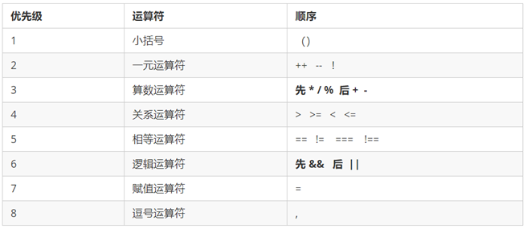

## 1. 运算符(也叫操作符)： 
1. 通过运算符可以对一个或多个值进行计算，并获取运算结果；
2. typeof就是运算符，可以获得一个值的类型；
   1. 会将该值的类型以字符串的形式返回；
   2. 包括number string boolean undefined object；
## 2. 算数运算符（+ - * / %）
1. 对非Number类型的值进行运算时，会将这些值转换为Number然后再运算；
2. 任何值和NaN运算都得 NaN；
3. 在JS中整数的运算基本可以保证精确；
4. 如果使用JS进行浮点运算，可能得到一个不准确的结果，所以千万不要使用JS进行对精确度要求比较高的运算；
   ```
   var c = 123 +345;
   var c = 0.1 +0.2;//0.30000000000000004
   ```
5. 注意算术运算符优先级:先乘除，后加减，有小括号先算小括号里面的;
6. 表达式和返回值：
   1. 表达式：是由数字、运算符、变量等以能求得数值的有意义排列方法所得的组合；
   2. 返回值：表达式最终都会有一个结果，返回给我们；
   3. 在程序里面写法 var num = 1 + 1;右边表达式计算完毕把返回值给左边；
   4. **任何表达式都有返回值！！**
### 2.1 加法 + ：
      1. 可以对两个值进行加法运算，并将结果返回；
      2. 两个字符串进行加法运算，则会做拼串（两个字符串拼接为一个字符串，并返回）;
      3. 任何值和字符串做加法运算，都会先转换为字符串，然后再和字符串做拼串得操作；(只有加法！！！)
      ```
      var a = 123;
      var result = typeof a;
      //console.log(typeof result);
      result = a + 1;////124
      result = 456 + 789;////1245
      result = true + 1;////2
      result = true + false;////1
      result = 2 + null;////2
      result = 2 + NaN;////NaN
      result = "123" + "456";////"123456"
      result = "你好" + "呼唤";////"你好呼唤"
      var str = "剪辑," + 
                  "胯宽," + 
                  "还好"; ////"剪辑,胯宽,还好"
      //console.log(str);
      result = 123 + "1";////"1231"
      console.log(result);
      //任何值和字符串相加都会转换为字符串，并作拼串操作；
      //所以可以为任意类型数据 + 一个"" 即可将起转换为String
      //叫做隐式类型转换，由游览器自动完成，实际上也是调用String()函数
      c = c + "";
      //经常使用，能够看清 c的值
      console.log("c = "+c);////"c = 123"
      result = 1 + 2 + "3";////result = "33"
       result = "1" + 2 + 3;////result = "123"
      console.log("result = "+result);
### 2.2 减法 -  :可以对两个值进行减法运算，并将结果返回
   ```
   result = 100 - 5;////95
   result = 100 - true;////99
   result = 100 - "1";////99,把"1"转换为number在减
   console.log("result = "+result);
   ```
### 2.3 乘法 * ：可以对两个值进行乘法运算
   ```
   result = 2 * 2;////4
   result = 2 * "8";////16,转成number再做运算
   result = 2 * undefined;////NaN，转成number是NaN,任何值和NaN运算都是NaN
   result = 2 * null;////0
   console.log("result = "+result);
   ```
### 2.4 除法 / ：可以对两个值进行除法运算
   ```
   result = 4 / 2;////2
   result = 3 / 2;////1.5
   console.log("result = "+result);
   ```
### 2.5 任何值做 - * / 运算都会自动转换为Number，所以可以做隐式得类型转换（为一个值 -0,*1，/1将其转换为Number，原理和Number()函数一样,但使用更加简单）
   ```
   var d = "123";
   d = d - 0;
   console.log(typeof d);////number
   console.log(d);////123
   ```
### 2.6 百分号 % ：取模运算（取余数）
1. 判断一个数能够被整除：余数是0，这就是 % 取余运算符的主要用途;
   ```
   result = 9 % 3;////0
   result = 9 % 4;////1
   result = 9 % 5;////4
   console.log("result = "+result);
   ```
## 2. 一元运算符：只需要一个操作数
### 2.1 正号 + ：不会对数字产生任何影响；
### 2.2 负号 - ：可以对数字进行负号的取反；
### 2.3 对于非Number类型的值：
   1. 会先转换为Number，然后再运算
   2. 可以对一个其他的数据类型使用 + ，将其转换为number
   3. 原理和Number()函数一样
   ```
   var a = 123;
   a = -a;////-123
   a = true;////1
   a = -a;////-1
   a = "18";
   a = +a;///18
   <!-- console.log(typeof a);
   console.log("a = "+a); -->
   var result = 1 + +"2" + 3;///6
   console.log("result = "+result);
   ```
## 3. 自增和自减运算符(必须配合变量使用)
### 3.1 自增：通过自增可以使变量在自身的基础上增加1；都会立即使原变量的值自加1；
   ```
   //想要一个变量自己加 1 
   var a = 1;
   a = a + 1;//++a
   a = a + 1;//3
   console.log("a = "+a);
   ```
   1. 前置递增运算符 ：++a的值等于新值（自增后的值）

   **口诀：先自加 1 ，后返回值**
   ```
   var age = 10;
   ++age;//类似于age = age + 1
   console.log(age); // 11
   //先加1，后返回值
   var p = 10;
   console.log(++p + 10);//21
   ```

   2. 后置递增运算符 ：a++的值等于原变量的值（自增前的值）
      1. 前置自增和后置自增如果单独使用，效果一样；
      2. 后置自增口诀：先表达式返回原值，再自变量自加1；
      3. 变量永远比表达式大1；
   **口诀：先返回原值，后自加 1**
   ```
   var a = 10;
   a++；//a = a + 1   ++a 
   console.log(a);//11
   //1. 前置自增和后置自增如果单独使用，效果一样
   //2. 后置自增口诀：先表达式返回原值，再自变量再自加1
   var a = 10;
   console.log(a++ + 10);//20,
   console.log(a);//11
   var b = 20;
   var result = b++ + ++b + b;//20+22+22//64
   console.log("result = "+result);
   //b = b++;
   //console.log(b);//20
   ```
### 3.2 自减：通过自减可以使变量在自身基础上减1 ，都会立即使原变量的值自减1；
   1. 后--：a--的值是变量的原值（自减前的值）
   2. 前--：--a的值是变量的新值（自减后的值）
   ```
   var num = 10;
   //num--;//9
   //--num;//9
   console.log(num--);//10
   console.log(--num);//9
   console.log(num);
   ```
## 4.逻辑运算符：开发经常用于多个条件判断
### 4.1 ！非 （not）：可以用来对一个值进行非运算（取反）
   1. 指对布尔值进行取反操作，true变false，false变true；
   2. 如果对一个值进行两次取反，值不会变化；
   3. 如果对非布尔值进行运算，则会将其转换为布尔值，然后再取反；
   ```
   var a = true;
   //a = !a;//false
   a = !!a;//true
   console.log("a =" +a);
   ```
### 4.2 && 与 (and)：对符号两侧的值进行与运，并返回结果
#### 4.2.1 对布尔值运算规则：（主要是找false）**一假则假，同真则真**
   1. 两个值，只要有一个为false，就返回false；
   2. 两个值都为true，就返回true；
   ```
   var result = true && true;//true
   var result = false && true;//false
   console.log("result = " + result);
   ```
   3. JS中的“与”属于短路与：如果第一个值为false，则不会看第二个值。
   ```
   true && alert("看我出来吗");//出来了
   false && alert("看我出来吗");//没出来
   ```
#### 4.2.2 对非布尔值运算：会将其先转换为布尔值，然后再运算，并返回原值
   1. 如果第一个值为true，则返回第二个值；
   2. 如果第一个值为false，则返回第一个值；
   ```
   //与运算：如果两个值都是true，则返回后面的
   var result = 5 && 6;//true && true//6

   //如果有一个值为false，则返回靠前的false
   result = 0 && 2;//false && true//0
   result = 2 && 0;//true && false //0

   //false && false
   result = NaN && 0;//false && false //NaN
   result = 0 && NaN;//false && false //0
   console.log("result = " + result);
   ```
### 4.3 || 或 (or)：可以对符号两侧的值进行或运算，并返回结果
#### 4.3.1 对布尔值运算规则：（主要是找true）**一真则真，同假则假**
   1. 两个值只要有一个true，则返回true；
   2. 如果两个值都为false，才返回false；
   ```
   //如果两个值都为false，才返回false；
   result = false || false;//false
   //两个值只要有一个true，则返回true；
   result = true || false;//true
   result = false || true;
   result = true || true;
   console.log("result = " + result);
   ```
   3. JS中的“或”属于短路的或：如果第一个值为true，则不会看第二个值。
   ```
   //第一个值为false，则会检查第二个
   false && alert("看我出来吗");//出来
   //第一个值为true，则不再检查第二个值
   true && alert("看我出来吗");//没出来
   ```
#### 4.2.2 对非布尔值运算：
   1. 如果第一个值为true，则直接返回第一个值；
   2. 如果第一个值为false，则返回第二个值；
   ```
   result = 2 || 1;//2
   result = 1 || NaN;//1
   result = NaN || 1;//1
   result = 0 || NaN;//NaN
   result = " " || "hello";//"hello"
   result = -1 || "hello";//-1
   console.log("result = " + result);
   ```
## 4.4 短路运算（逻辑中断）（重要！！）
1. 当有多个表达式（值）时，左边的表达式值可以确定时，就不再继续运算右边的表达式的值；
   ```
   //逻辑中断很重要，影响程序运行结果
   var num =0;
   console.log(123 || num++);
   console.log(num);//0
   ```
## 5. 赋值运算符：可以将符号右边的值赋值给符号左边的变量
1. = ：a = 5;
2. += ：a += 5 等价于 a = a + 5;
3. -= : a -= 5 等价于 a = a - 5;
4. *= : a *= 5 等价于 a = a * 5;
5. /= : a /= 5 等价于 a = a / 5;
6. %= : a %= 5 等价于 a = a % 5;
## 6. 比较运算符 （关系运算符）：比较两个值之间的大小关系，关系成立，返回true，不成立则返回false
### 6.1 数值情况：
   1. 大于号 > ：
      1. 判断符号左侧的值是否大于右侧的值；
      2. 如果关系成立，返回true，关系不成立，则返回false；
   2. 大于等于 >= ：
      1. 判断符号左侧的值是否大于或等于右侧的值；
      2. 如果关系成立，返回true，关系不成立，则返回false；
   3. 小于号 <：同理
   4. 小于等于 <=：同理
   ```
   var result = 5 > 10;//false
   var result = 5 >= 5;//true
   console.log("result = " + result);
   ```
### 6.1 非数值情况：会将其转换为数字然后再比较
   1. 如果符号两侧都是字符串，不会将其转换为数字比较，而会分别比较字符串中字符的Unicode编码；
   2. 任何值和NaN做任何比较都是false；
   3. 比较字符编码时，是一位位进行比较，如果两位一样，则比较下一位；（可以借用来对英文进行排序，比较中文没有意义）
   4. 在比较两个字符串型的数字时，一定要转型(字符串前面加上+，会转换为Number数值)
   ```
   console.log(1 > true);//1>1 false
   console.log(1 >= true);//1>=1 true
   console.log(1 > "0");//1>0 true
   console.log(10 > null);//10>0 true
   //任何值和NaN做任何比较都是false
   console.log(10 <= "hello");//10<=NaN 转换为数值是NaN,false
   console.log(true > false);//1>0,true
   //两个字符串时，比较的是字符编码
   console.log("1" < "5");//true
   console.log("11" < "5");//true
   console.log("a" < "b");//false
   //比较字符编码时，是一位位进行比较
   //如果两位一样，则比较下一位
   //可以借用来对英文进行排序
   console.log("abc" < "b");//true
   //如果比较的两个字符串型的数字，可能会得到不可预期结果
   //注意：在比较两个字符串型的数字时，一定要转型(字符串前面加上+，会转换为Number数值)
   console.log("1142242" < +"5");//false
   ```
## 7. 编码：
1. 在字符串中使用转义符输入Unicode编码：\u四位编码(16进制)；
   ```
   console.log("\u2620");
   ```
1. 在网页中使用Unicode编码：&#编码（这里编码需要10进制）
   ```
   <h1>&#9760;<h1>
   ```
## 8. 比较运算符
### 8.1 == ：比较两个值是否相等 （自动做类型转换）
1. 如果相等会返回true，否则返回false；
2. 当使用==来比较两个值时，如果值的类型不同：会自动将其转换为相同的类型，然后再比较；
   ```
   console.log(1 == 1);//true
   var a = 10;
   console.log(a == 4);//false
   //一般会转换成数值 
   console.log("1" == 1);//true
   console.log(true == "1");//true
   //特殊情况（没有转换成数值）
   console.log(null == 0);//false
   ```
3. undefined 衍生自 null：两个值做相等判断时，会返回true;
   ```
   console.log(undefined == null);//true
   ``` 
4. NaN不和任何值相等，包括它本身：
   ```
   console.log(NaN == NaN);//false
   ``` 
   1. 判断b的值是否是NaN，可以通过isNaN()函数,是返回true，不是则返回false；
   ```
   var b = NaN;
   //console.log(b == NaN);
   console.log(isNaN());//true
   console.log(undefined == null);//true
   ``` 
   2. isNaN()函数：判断一个变量是否为非数字的类型，是返回false，不是则返回true；
5. 不能直接拿浮点数进行比较是否相等
   ```
   var num = 0.1 + 0.2;//0.3000000000000004
   console.log(num == 0.3);//false
   ```
### 8.2 != ：比较两个值是否不相等 
1. 如果不相等会返回true，否则返回false；
2. 当使用!=来比较两个值不相等时，也会进行类型转换，转换后相等也会返回false；
   ```
   console.log(10 != 5);//true
   console.log("abc" != "abc");//false
   console.log("1" != 1);//false
   ```
### 8.3 === ：全等（不做类型转换）：用来判断两个值是否全等，和相等类似；
1. 要求两侧的值和数据类型完全一致才是true;
2. 如果两个值的类型不同，直接返回false；
   ```
   console.log("1" === 1);//false
   console.log(null === undefined);//false,相等但不全等
   ```
### 8.4 !== ：不全等（不做类型转换）
1. 用来判断两个值是否不全等；
2. 如果两个值的类型不同，直接返回false；
   ```
   console.log("1" !== 1);//true
   ```
## 9. 运算符优先级
**一元运算符里面的逻辑非 !优先级很高**
**逻辑与 && 比逻辑或 ||优先级高**
1. 小括号：()
2. 一元运算符：++ -- ！
3. 算数运算符：先 * / % 后+ -
4. 关系运算符：> >= < <=
5. 相等运算符：== != === !==
6. 逻辑运算符：先&& 后||
7. 赋值运算符：=
8. 逗号运算符：,

```
console.log( 4 >= 6 || '人' != '阿凡达' && !(12 * 2 == 144) && true)//true
var num = 10;
console.log( 5 == num / 2 && (2 + 2 * num).toString() === ‘22’)；//true
```
## 10. 三元表达式
1. 由三元运算符（? :）组成的式子称为三元表达式； 三元表达式也能做一些简单的条件选择。 
2. 语法结构：条件表达式 ? 表达式1 : 表达式2;
3. 执行思路 :
   1. 如果条件表达式为 true ，则返回表达式1的值；
   2. 如果条件表达式为 false，则返回表达式2的值；
4. 简单理解： 就类似于 if else（双分支） 的简写；
```
var num = 10;
var result = num > 5 ? '是的' : '不是';//表达式有返回值//把返回值赋值给一个变量
console.log(result);//是的
```